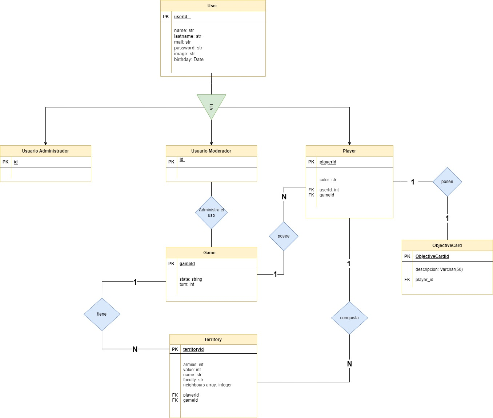
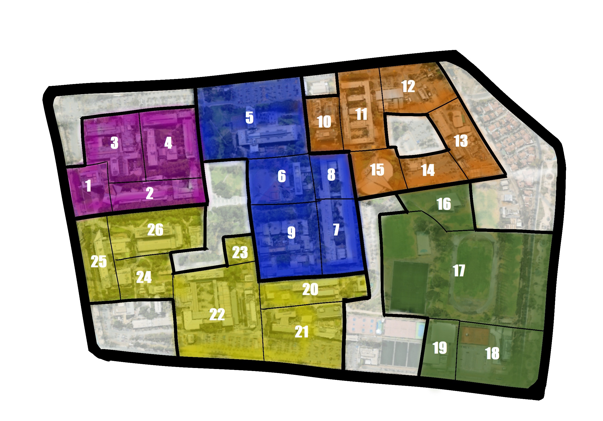

# grupo-OLMA-backend

## Setup

1. Primero, correr `yarn` para descargar las dependencias de la api.

2. Crear archivo **.env** y agregar:

        DB_USERNAME = [tu username]
        DB_PASSWORD = [tu password]
        DB_NAME = olmadb
        DB_HOST = 'localhost'

3. Correr los siguientes commandos en el **terminal** para crear la base de datos, migrarla y seedearla:

        yarn sequelize-cli db:create
        yarn sequelize-cli db:migrate
        yarn sequelize-cli db:seed:all

4. Finalmente, correr lo siguiente en el **terminal** para empezar el servidor:

        yarn dev

## Relaciones y Entidades

Se siguió el siguiente diagrama de clases para construir la base de datos.

## Algunas consideraciones

- Los territorios tienen un attributo llamado `value`, este representa a cual territorio del mapa nos referimos y nos ayuda a revisar sus vecinos. Es necesario agregar este para cuando tengamos varias partidas en curso.

## Lógica de juegos

Se implementaron las siguientes acciones de lógica de juego

- `GET` para obtener el estado de una partida a partir de su `id`, con todos los jugadores, sus territorios conquistados y cuantas tropas en cada uno. Devuelve un JSON con la información.

        GET /games/show/:id

- `GET` para asignar las cartas objetivo 'PlayerObjectives' a cada jugador. Estas pueden ser conquistar ciertos territorios o eliminar a otro jugador. Devuelve un mensaje que fueron asignadas correctamente.

        GET /players/cards_territories/:id

- `GET` encontrar todas las partidas en los que juega un Usuario. Devuelve un array con los gamesIds que tiene ese usuario.

        GET /players/user_games/:id

- `GET` para encontrar el número de territorios que tiene un jugador, para así retornar el numero de ejércitos que podrá agregar. Devuelve un int con los armies a agregar.

        GET /players/number_armies/:id

- `GET` para obtener los territorios y tropas de un jugador en especifico, buscado a traves de su `id`. Devuelve un JSON con la informacion.

        GET /players/show_territories/:id

- `POST` para mover las tropas de un territorio propio a otro. Notar que se revisa si estos son vecinos y que el territorio fuente no quede sin ejercitos. Se le debe entregar un JSON del formato especificado. Además, se preocupa de actualizar la base de datos con los cambios. Devuelve un mensaje con una descripción del movimiento.

        POST territories/move
        JSON {  "gameId": el id de la partida,
                "from": valor del territorio de donde se sacan las tropas,
                "to": valor del territorio a donde llegan las tropas,
                "armies": cantidad de tropas a mover }

- `POST` para actualizar el turno de la partida, es decir, cambiar el turno del jugador. Se le debe entregar un JSON del formato especificado. Además, se preocupa de actualizar la base de datos con los cambios. Devuelve un mensaje con que se logró cambiar de turno.

        POST games/update_turn
        JSON {  "gameId": el id de la partida a cambiar turno}

- `POST` para agregar tropas a un territorio. Devuleve un mensaje con una descripcion de la accion.

        POST territories/add
        JSON {  "gameId": el id de la partida,
                "value": valor del territorio a donde agregar las tropas,
                "armies": cantidad de tropas a agregar }

- `POST` para atacar a un territorio. Se considera que hay un territorio que ataca y otro que defende, y que se recibe los resultados de los dados de cada bando, donde la cantidad de dados indica la cantidad de ejercitos en combate. A partir de estos, se calcula el resultado siguiendo las reglas del juego y cuantas tropas perecen. Por otro lado, se revisa si ocurren dos casos: el atacante destruye todas las tropas y gana el territorio, o este se queda sin tropas y no puede seguir atacando. Finalmente, se actualiza la base de datos. (El lanzamiento de los dados ya se implementó en el frontend). Devuelve un JSON con dos entradas, la accion que se realizo y sus consecuencias.

        POST attack
        JSON {  "gameId": id de la partida,
                "attacker": valor del territorio atacante,
                "defender": valor del territorio que defiende,
                "attacker_dice": lista con los dados del atacante,
                "defender_dice": lista con los dados del defensor }

Otras acciones implementadas que no se utilizan durante una partida, pero que se podrían necesitar para crear una.

- `POST` para crear un nuevo jugador, el cual se encuentra asociado a una partida y un usuario.

        POST users/create
        JSON {  "color": "red",
                "userId": id del usuario,
                "gameId": id de la partida }

- `POST` para crear una nueva partida entre los usuarios especificados por su id. Esta creará los territorios y los repartirá entre los jugadores de manera aleatoria, pero uno a la vez, por lo que todos los jugadores tendrán casi la misma cantidad de territorios.

        POST games/create
        JSON {[ userId1, userId2, userId3, userId4]}

Acciones necesarias para el funcionamiento de la página general, no para el juego.

- `POST` para crear un nuevo usuario.

        POST users/create
        JSON {  "name": nombre de usuario,
                "lastName": apellido de usuario,
                "password": contraseña,
                "mail": email,
                "image": imagen de perfil (por ahora es un string),
                "birthday": fecha de nacimiento }

## Validaciones y restricciones

### Restricciones

- `User`: Existen restricciones de no tolerar Nulls para el `name`, `lastname` y `mail`. Además el `mail` trata como único.
- Como el modelo `User` es el único que interactua con el usuario, es el único campo que requiere restricciones ya que el resto es incorporado por nosotros y no es necesario incluirlas.

### Validaciones

- `User`: Existen validaciones de que el `name` como el `lastname` deben ser alfanuméricos. También el `mail` debe tener un formato mail, que está implementado. Además creamos una validación personalizada para la contraseña, ya que debe contener al menos un número y un caracter especial.

- Al igual que con las restricciones como el modelo `User` es el único que interactua con el usuario, es el único campo que requiere validaciones ya que el resto es incorporado por nosotros y no es necesario incluirlas.
